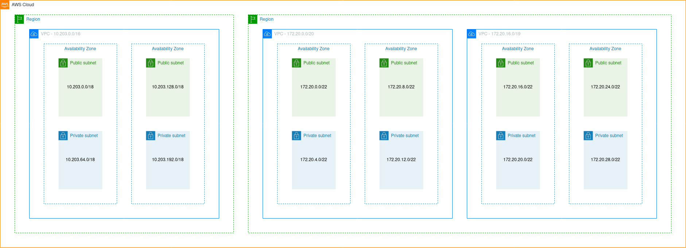
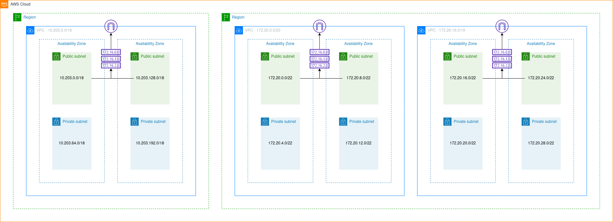
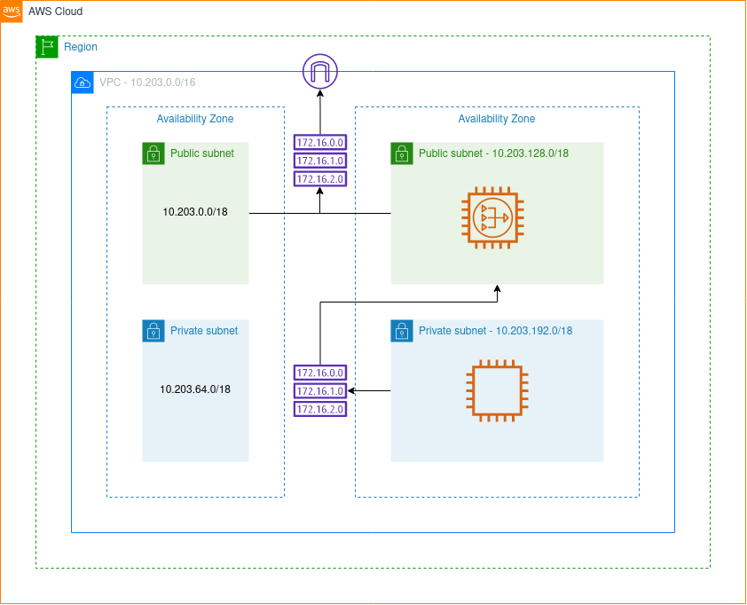
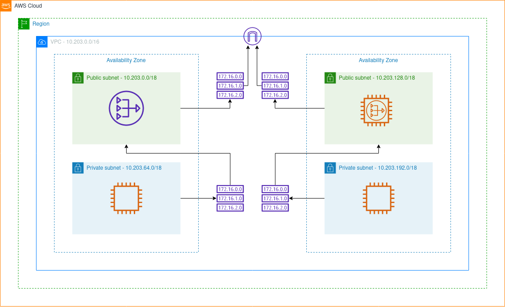
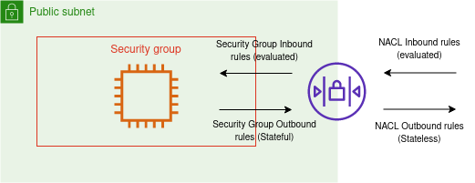
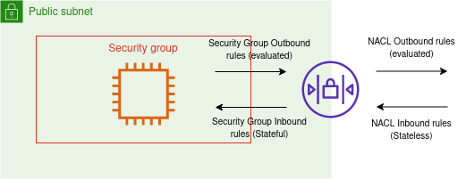
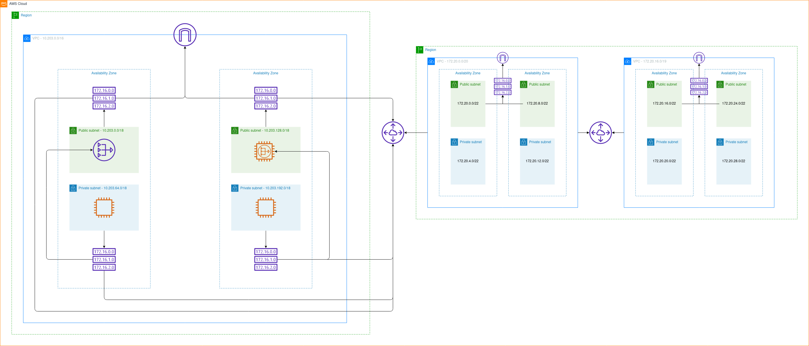
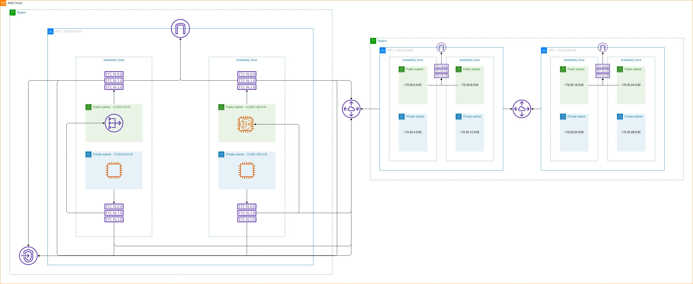

# AWS Network Architecture
All the resources described on this section are available through the VPC dashboard. This resouces are less common to be changed, so it's important to review it before taking the certification exam.

## The Default VPC

All new accounts have a default VPC, and this is where your resources will be created if nothing is specified.

- All instances have access to the internet
- All instances have public IP
- All instances have public and private DNS

## Virtual Private Cloud (VPC) Overview

- Up to 5 VPCs per region (Soft limit - open a case to add more)
- Maximum CIDR per VPC is 5 (and only private ranges)
  - Minimum: /28
  - Maximum: /16

**Note:** CIDR should not overlap

## Subnets

A subnet is a range of IP addresses in your VPC. You can launch AWS resources into a specified subnet. Use a public subnet for resources that must be connected to the internet, and a private subnet for resources that won't be connected to the internet.

Each subnet must reside entirely within one Availability Zone and cannot span zones.

**Constraints:**
- AWS reserves 5 IP addresses in each subnet (First 4 and last one).
- This IPs cannot be used for any instances
- Using 10.0.0.0/24 as an example:
  - 10.0.0.0: Network address
  - 10.0.0.1: VPC Router
  - 10.0.0.2: Amazon-provided DNS mapping
  - 10.0.0.3: Reserved for future use
  - 10.0.0.255: Broadcast address

## Internet Gateway and Route Tables

An internet gateway is a horizontally scaled, redundant, and highly available VPC component that allows communication between your VPC and the internet with IPv4 and IPv6 traffic.

An internet gateway serves two purposes: provides internet-routable traffic and performs network address translation (NAT) for public instances with IPv4 addresses.

**Note:** You can have only one Internet Gateway per VPC.

But an Internet Gateway does not allow internet access by itslef, you need to add a route to your subnet's route table that directs internet-bound traffic to the internet gateway.

## NAT Instances 
> End of standard support on December 31, 2020.

NAT instances are customer-managed instances responsible for network address translation. They allow the connection from private subnets to the internet, but not otherwise.

**Requirements:**
- Launch an instance on a public subnet
- Attach an Elastic IP
- Disable EC2 flag: Source/Destination Check
- Configure private subnet's route table to the NAT Instance
- Don't forget to configure the security group properly
- **Optional:** You can use Amazon's AMI for this

**Issues:**
- Support has already ended
- Not highly available out of the box (Requires multi-az ASG)
- Bandwith depends on the EC2 instance performance
- Must manage security group rules

## NAT Gateway

AWS Managed NAT with higher bandwidth (5 Gpbs to 45 Gbps), high available and scales automatically.

NAT Gateway requires a Internet Gateway and a route table setup, but it doesn't need an security group to manage it.

It can only be used by instances on a different AZ.

## Network ACL and Security Group

Before understanding how NACL and SGs works, it important to understant two concepts:

> **Stateless:** Can be understood as in isolation. Each transaction is made as if from scratch for the first time.
> **Stateful:** Performed with the context of previous transactions.

With that in mind, we can understand how the network flow is evaluated.

### **Inbound/Incoming Traffic**

For inbound traffic:
1. Request is evaluated at the NACL level - NACL Inboud Rule
2. Request is evaluated at the SG level - SG Inboud Rule
3. Request is not evaluated at the SG level (Stateful) - SG Outbound Rule
4. Request is evaluated at the NACL level (Stateless) - NACL Outbound Rule

### **Outbound/Outgoing Traffic**

For Outbound traffic:
1. Request is evaluated at the SG level - SG Outbound Rule
2. Request is evaluated at the NACL level - NACL Outbound Rule
3. Request is evaluated at the NACL level (Stateless) - NACL Inbound Rule
4. Request is not evaluated at the SG level (Stateful) - SG Inbound Rule

### **NACL**

Network Access Control Lists controls the network traffic from and to the subnets.

Each subnet can have one NACL assigned, when they are created, they are assigned to the Default NACL.

Default NACL allows everything, outbound and inbound, while newly created NACL will deny everything.

Rules:
- Rules have a number (1-32766), where lower number has a higher priority
- If two rules are contradictory, lower number will be applied.
- Last rule is an asterisk (*) and denies in case of no match

## VPC Peering

VPC Peering is a way to connect one VPC to another so they can behave as they are on the same network.

> ***Do not have overlaping CIDR***

Peering is not transitive. A VPC peering must be established between each VPC

The first VPC can only access the resources from the second. 

The second VPC can access the resources from the first and the third.

The third VPC can only access the resources from the second.

## VPC Endpoint

VPC Endpoints can be create so your resources can access AWS services without the need to connect to the internet.

There two type of endpoints:
- Interface Endpoint: service uses an ENI as an entry point - and require a Security Group
- Gateway Endpoint: **For S3 and DynamoDB** - and requires a route table entry.

## Site to site VPN, Virtual Private Gateway & Customer Gateway