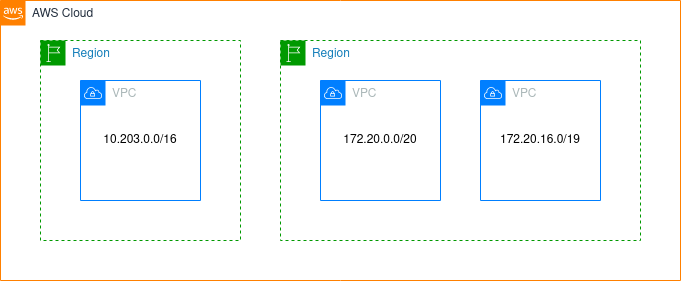

# AWS Network Architecture
All the resources described on this section are available through the VPC dashboard. This resouces are less common to be changed, so it's important to review it before taking the certification exam.

## The Default VPC

All new accounts have a default VPC, and this is where your resources will be created if nothing is specified.

- All instances have access to the internet
- All instances have public IP
- All instances have public and private DNS

## Virtual Private Cloud (VPC) Overview

- Up to 5 VPCs per region (Soft limit - open a case to add more)
- Maximum CIDR per VPC is 5 (and only private ranges)
  - Minimum: /28
  - Maximum: /16

**Note:** CIDR should not overlap

## Subnets

A subnet is a range of IP addresses in your VPC. You can launch AWS resources into a specified subnet. Use a public subnet for resources that must be connected to the internet, and a private subnet for resources that won't be connected to the internet.

Each subnet must reside entirely within one Availability Zone and cannot span zones.

**Constraints:**
- AWS reserves 5 IP addresses in each subnet (First 4 and last one).
- This IPs cannot be used for any instances
- Using 10.0.0.0/24 as an example:
  - 10.0.0.0: Network address
  - 10.0.0.1: VPC Router
  - 10.0.0.2: Amazon-provided DNS mapping
  - 10.0.0.3: Reserved for future use
  - 10.0.0.255: Broadcast address

## Internet Gateway and Route Tables

An internet gateway is a horizontally scaled, redundant, and highly available VPC component that allows communication between your VPC and the internet with IPv4 and IPv6 traffic.

An internet gateway serves two purposes: provides internet-routable traffic and performs network address translation (NAT) for public instances with IPv4 addresses.

**Note:** You can have only one Internet Gateway per VPC.

But an Internet Gateway does not allow internet access by itslef, you need to add a route to your subnet's route table that directs internet-bound traffic to the internet gateway.

## NAT Instances 
> End of standard support on December 31, 2020.

NAT instances are customer-managed instances responsible for network address translation. They allow the connection from private subnets to the internet, but not otherwise.

**Requirements:**
- Launch an instance on a public subnet
- Attach an Elastic IP
- Disable EC2 flag: Source/Destination Check
- Configure private subnet's route table to the NAT Instance
- Don't forget to configure the security group properly
- **Optional:** You can use Amazon's AMI for this

**Issues:**
- Support has already ended
- Not highly available out of the box (Requires multi-az ASG)
- Bandwith depends on the EC2 instance performance
- Must manage security group rules

## NAT Gateway